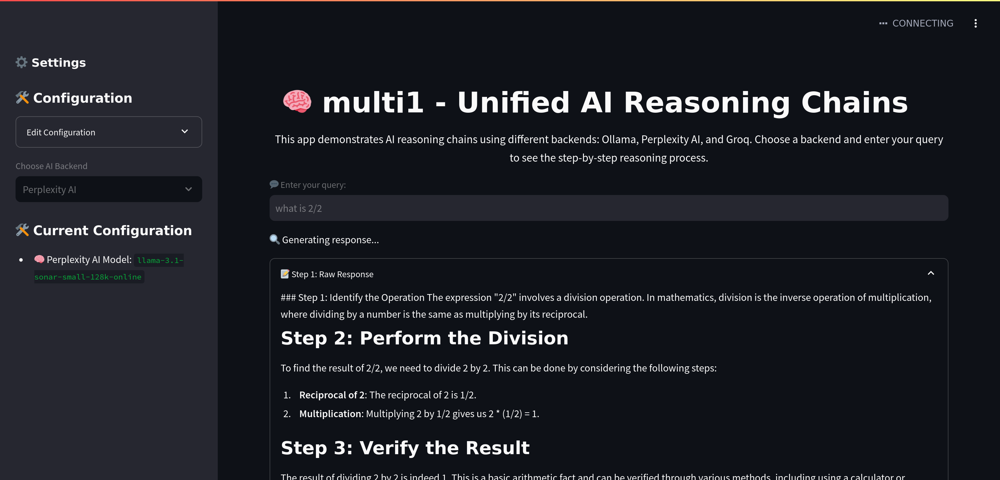

# multi1: Using multiple AI providers to create o1-like reasoning chains

This is an early prototype of using prompting strategies to improve the LLM's reasoning capabilities through o1-like reasoning chains. This allows the LLM to "think" and solve logical problems that usually otherwise stump leading models. Unlike o1, all the reasoning tokens are shown.

## Features

- [x] Using an unified interface to try out different providers
- [x] LiteLLM default provider with local and remote support
- [x] Configuring the app from the sidebar
- [x] Modular design for quick provider adding 

## Providers

- [x] LiteLLM (local and remote)
- [x] Ollama (local)
- [x] Perplexity (remote, requires API key)
- [x] Groq (remote, requires API key)

## Developer Resources

- Instructions for adding new providers can be found in `app/utils/providers/instructions.md`
- A skeleton provider template is available at `app/utils/providers/skeleton_provider.py`

## Work in progress

- [ ] Further LiteLLM testing with remote providers
- [ ] Create a better way to add new providers for developers

## Example



## Description

***IMPORTANT: multi1 is a fork of [g1](https://github.com/bklieger-groq/g1/), made by [Benjamin Klieger](https://x.com/benjaminklieger). It was made as a way to experiment with multiple AI providers included local LLMs. All credits go to the original author.***

This is an early prototype of using prompting strategies to improve the LLM's reasoning capabilities through o1-like reasoning chains. This allows the LLM to "think" and solve logical problems that usually otherwise stump leading models. Unlike o1, all the reasoning tokens are shown, and the app uses an open source model.

multi1 is experimental and being open sourced to help inspire the open source community to develop new strategies to produce o1-like reasoning. This experiment helps show the power of prompting reasoning in visualized steps, not a comparison to or full replication of o1, which uses different techniques. OpenAI's o1 is instead trained with large-scale reinforcement learning to reason using Chain of Thought, achieving state-of-the-art performance on complex PhD-level problems.

multi1 demonstrates the potential of prompting alone to overcome straightforward LLM logic issues like the Strawberry problem, allowing existing open source models to benefit from dynamic reasoning chains and an improved interface for exploring them.


### How it works

multi1 powered by one of the supported models creates reasoning chains, in principle a dynamic Chain of Thought, that allows the LLM to "think" and solve some logical problems that usually otherwise stump leading models.

At each step, the LLM can choose to continue to another reasoning step, or provide a final answer. Each step is titled and visible to the user. The system prompt also includes tips for the LLM. There is a full explanation under Prompt Breakdown, but a few examples are asking the model to “include exploration of alternative answers” and “use at least 3 methods to derive the answer”.

The reasoning ability of the LLM is therefore improved through combining Chain-of-Thought with the requirement to try multiple methods, explore alternative answers, question previous draft solutions, and consider the LLM’s limitations. This alone, without any training, is sufficient to achieve ~70% accuracy on the Strawberry problem (n=10, "How many Rs are in strawberry?"). Without prompting, Llama-3.1-70b had 0% accuracy and ChatGPT-4o had 30% accuracy.


### Disclaimer

> [!IMPORTANT]
> multi1 is not perfect, but it can perform significantly better than LLMs out-of-the-box. From initial testing, multi1 accurately solves simple logic problems 60-80% of the time that usually stump LLMs. However, accuracy has yet to be formally evaluated. See examples below.


### Quickstart

To use the launcher, follow these instructions:

1. Set up the environment:

   ```
   python3 -m venv venv
   source venv/bin/activate
   pip3 install -r requirements.txt
   ```

2. Copy the example environment file:

   ```
   cp example.env .env
   ```

3. Edit the .env file with your API keys / models preferences (or do it from the app's configuration menu)

4. Run the main interface

   ```
   streamlit run app/main.py
   ```

---

### Prompting Strategy

The prompt is as follows:

```
You are an expert AI assistant that creates advanced reasoning chains. For each step, provide a title and content that demonstrates your thought process. Respond in JSON format with 'title', 'content', and 'next_action' (either 'continue' or 'final_answer') keys. FOLLOW THESE GUIDELINES:
1. USE AT LEAST 5 REASONING STEPS, aiming for 7-10 steps for complex problems.
2. EMPLOY MULTIPLE METHODS: Use at least 3 distinct approaches to derive the answer.
3. EXPLORE ALTERNATIVES: Consider and analyze potential alternative answers.
4. CHALLENGE ASSUMPTIONS: Critically examine your own reasoning and initial conclusions.
5. ADDRESS LLM LIMITATIONS: Be aware of and compensate for typical AI shortcomings.
6. VISUALIZE WHEN POSSIBLE: If applicable, describe how you would visually represent the problem.
7. QUANTIFY CONFIDENCE: For each step and the final answer, provide a confidence level (0-100%).
8. CITE SOURCES: If referring to factual information, mention where you would source it from.
9. ETHICAL CONSIDERATIONS: If relevant, discuss any ethical implications of the problem or solution.
10. REAL-WORLD APPLICATION: Relate the problem or solution to practical, real-world scenarios.
11. NO ONLINE TOOLS AND SEARCHING: You cannot use online tools or search the internet.

Example of a valid JSON response:
{
    "title": "Initial Problem Analysis",
    "content": "To begin solving this problem, I'll break it down into its core components...",
    "confidence": 90,
    "next_action": "continue"
}
```

#### Breakdown

First, a persona is added:

> You are an expert AI assistant that creates advanced reasoning chains.  


Then, instructions to describe the expected step-by-step reasoning process while titling each reasoning step. This includes the ability for the LLM to decide if another reasoning step is needed or if the final answer can be provided.

> For each step, provide a title and content that demonstrates your thought process.


JSON formatting is introduced with an example provided later.

> Respond in JSON format with 'title', 'content', and 'next_action' (either 'continue' or 'final_answer') keys.


In all-caps to improve prompt compliance by emphesizing the importance of the instruction, a set of tips and best practices are included as you can see above.

Finally, after the problem is added as a user message, an assistant message is loaded to provide a standardized starting point for the LLM's generation.

***NOTE: The final step is not applied in some providers, that do not support it.***


### Credits

g1 was originally developed by [Benjamin Klieger](https://x.com/benjaminklieger).
This multi1 fork was developed by [tcsenpai](https://github.com/tcsenpai).
